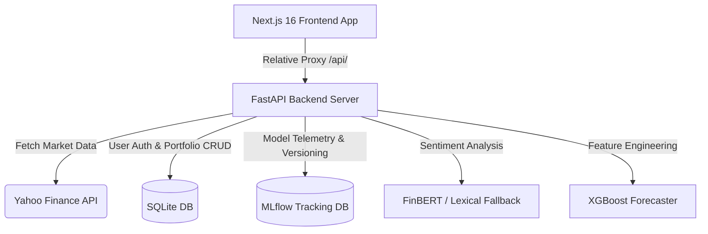

# Quantra — Financial Market Intelligence Platform

Quantra is a state-of-the-art multi-factor research desk and automated forecasting system. It fuses XGBoost prediction models, SHAP explainability attributions, news sentiment analysis, technical indicators, and real-time risk analytics (Value-at-Risk) into a high-performance terminal dashboard.

---

## 🏛️ System Architecture



### Key Technical Phases

1. **Frontend App Router Migration**: Modular feature-based React architecture using TypeScript, Tailwind CSS (v4), TanStack Query, and Recharts.
2. **FastAPI Backend Services**: Multi-threaded SQLite/SQLAlchemy database layer with user watchlist, portfolio allocations, and price-triggered alerts.
3. **User Auth & Isolation**: Strict JWT authentication with secure passwords hashed via `bcrypt==4.0.1`.
4. **Machine Learning Pipeline**: XGBoost regressors trained on 2 years of OHLCV daily data. Forecasts walk forward iteratively with confidence intervals.
5. **Explainability & Attribution**: SHAP tree-explainers analyze indicator drivers (RSI, SMA, realised volatility) behind model predictions.
6. **Sentiment Desk**: FinBERT transformer model pipeline analyzing market news headlines with a robust lexical keyword analyzer fallback.
7. **MLOps Registry & Drift Checking**: Pipeline metrics, parameters, and models logged to local SQLite-backed MLflow instances. Feature drift (Population Stability Index) measured on rolling windows.

---

## 🚀 Getting Started

### Prerequisites

- **Python**: 3.9+
- **Node.js**: 18+ (LTS recommended)
- **Docker & Docker Compose** (Optional, for containerized run)

### Environment Configuration

Create a `.env` file in the root directory (refer to `.env.example`):

```bash
DATABASE_URL=sqlite:///./quantra.db
SECRET_KEY=generate-a-strong-random-key-in-production
ACCESS_TOKEN_EXPIRE_MINUTES=1440
NEXT_PUBLIC_API_URL=http://localhost:8000
```

---

## 💻 Local Development Setup

### 1. Running the FastAPI Backend

Create a python virtual environment, install requirements, and boot the server:

```bash
# Navigate to project and create virtualenv
python3 -m venv .venv
source .venv/bin/activate

# Install backend dependencies
pip install -r backend/requirements.txt

# Run migrations
alembic upgrade head

# Start FastAPI server on port 8000
PYTHONPATH=. uvicorn backend.main:app --reload --port 8000
```

*Backend Swagger documentation will be available at [http://localhost:8000/docs](http://localhost:8000/docs).*

### 2. Running the Next.js Frontend

Open a new terminal tab, install npm packages, and boot the dev server:

```bash
# Install packages
npm install

# Start development client on port 3000
npm run dev
```

*Open [http://localhost:3000](http://localhost:3000) to view the terminal research desk. Live proxy rewrites route all client `/api` queries to the backend automatically.*

---

## 🐋 Containerized Deployment (Docker Compose)

To run the entire multi-service stack with a single command:

```bash
# Build and run containers
docker-compose up --build
```

The frontend will bind to [http://localhost:3000](http://localhost:3000) and the backend will bind to [http://localhost:8000](http://localhost:8000).

---

## 📊 MLOps, MLflow & Drift Audits

### MLflow Tracking Dashboard

Every model training run logs features, cross-validation parameters, and metrics to `mlflow.db`. To view the tracking server:

```bash
# Launch the MLflow UI pointing to the SQLite backend
mlflow ui --backend-store-uri sqlite:///mlflow.db
```

*Open [http://localhost:5000](http://localhost:5000) to inspect parameters, accuracy logs, and compare runs.*

### Feature Drift Auditing

Run the population stability index checking script:

```bash
# Calculate PSI covariate shift on NVDA features (or another ticker)
python mlops/drift_check.py NVDA
```

---

## 🧪 Testing

To run the full backend database, isolation, and integration test suite:

```bash
# Run backend tests
PYTHONPATH=. pytest backend/
```

To run frontend TypeScript validation and builds:

```bash
# Check TS compilation
npx tsc --noEmit

# Compile production bundle
npm run build
```
